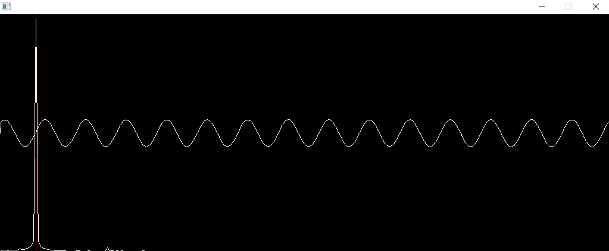

# Oscilloscope
Simple realtime oscilloscope with waveform and spectrograph. This utilises the kiss fft https://github.com/mborgerding/kissfft, sdl and portaudio libraries. 

# Demo
Simple sin wave.

